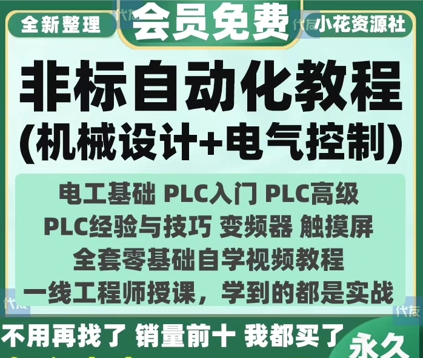
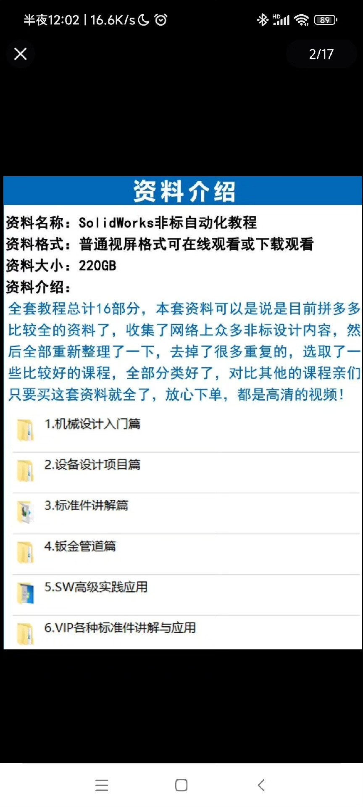
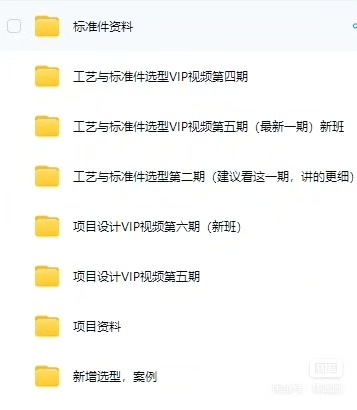
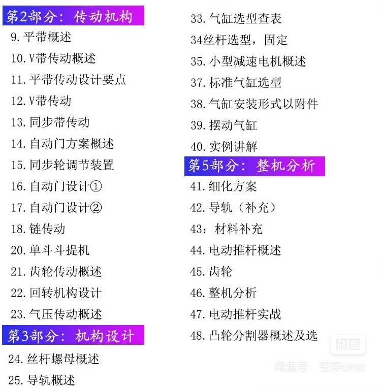
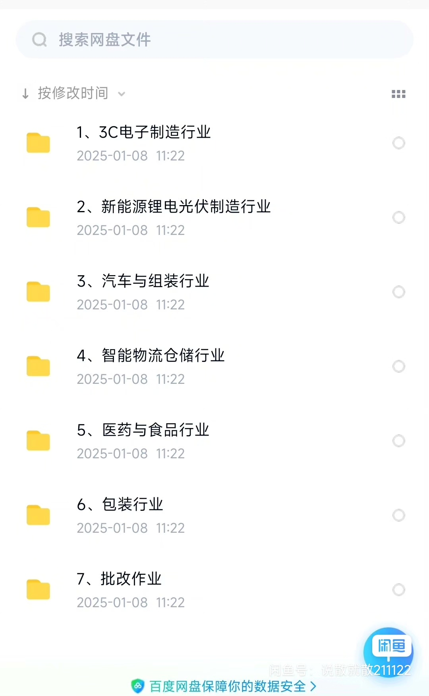

# The Ultimate Guide to Non-Standard Automation Equipment Mechanical Design

## Body

The Ultimate Guide to Non-Standard Automation Equipment Mechanical Design

Introduction:

In today's world, automation has become an essential part of our lives. It has revolutionized the way we work and has made our lives easier. However, with the increasing demand for automation, there is a need for more advanced and efficient equipment. This guide will provide you with the knowledge and skills needed to design your own non-standard automation equipment.

Chapter 1: Basic Knowledge of Automation

Before we start designing our own equipment, it is important to understand the basic concepts of automation. Automation refers to the use of machines or systems to perform tasks that would otherwise require human effort. It involves the use of sensors, actuators, and control systems to monitor and manipulate physical processes.

Chapter 2: Understanding Non-Standard Equipment

Non-standard equipment refers to equipment that is not designed or manufactured according to standard industry specifications. These equipment are often custom-made to meet specific requirements or to improve efficiency. They can be used in various industries such as manufacturing, healthcare, and transportation.

Chapter 3: Designing Non-Standard Equipment

Designing non-standard equipment requires a combination of mechanical, electrical, and software engineering skills. Here are some key steps to follow:

1. Identify the requirements: Determine the purpose and functionality of the equipment. Consider factors such as load capacity, speed, accuracy, and reliability.

2. Choose the appropriate materials: Select the right materials based on the requirements and operating conditions. For example, steel is commonly used for heavy-duty equipment, while plastics are preferred for lightweight designs.

3. Create the design: Use computer-aided design (CAD) software to create the 3D model of the equipment. This will help you visualize the design and identify potential issues before they become problems.

4. Test the design: Conduct tests to verify the functionality and performance of the equipment. This may involve prototyping or building a prototype from the design.

5. Refine the design: Based on the test results, make necessary modifications to the design. This may involve changing the dimensions, adding features, or modifying the control system.

6. Finalize the design: Once the design is refined, finalize the design by creating detailed drawings, specifications, and other documentation.

Chapter 4: Implementing the Design

Once the design is finalized, it is time to implement it into a working piece of equipment. This may involve several steps such as fabricating parts, assembling components, wiring, and testing the equipment.

Conclusion:

Designing non-standard automation equipment requires a combination of technical expertise and creativity. By following the steps outlined in this guide, you can develop your own unique equipment that meets your specific needs and requirements. Remember to stay up-to-date with the latest advancements in automation technology and seek professional advice when needed.

(Full product description was not available from the source page.)

## Images

## Payment

Here is a pay link on Stripe ( https://buy.stripe.com/3cs8yP7sY87d0vu9AB ). Please contact me lonlonago@foxmail.com after funding $89, and I will send you a complete data files , thank you!

